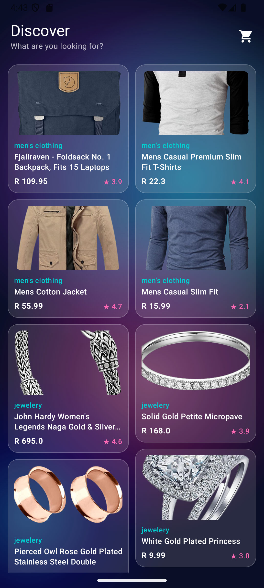
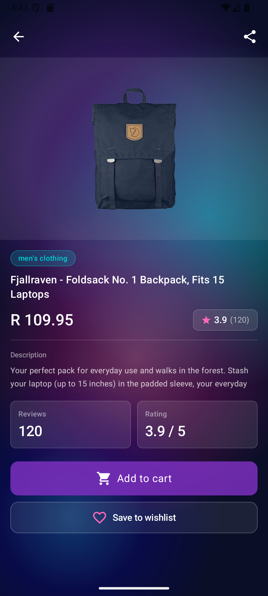
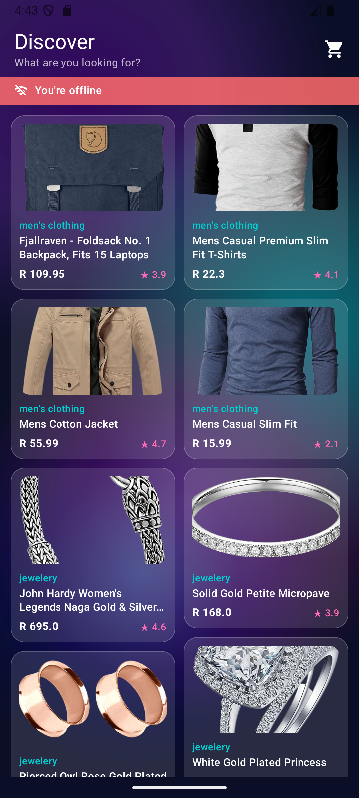
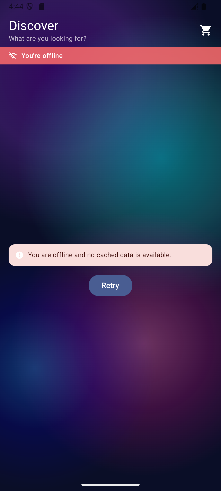

# Clothes App

A modern Android application for browsing clothes and products, built with Jetpack Compose and following clean architecture principles.

## 🚀 Tech Stack

### UI Layer
- **Jetpack Compose**: Modern toolkit for building native UI.
- **Material 3**: Latest Material Design components and theming.
- **Coil**: Image loading library for Android.
- **Compose Navigation**: For handling screen transitions and deep links.

### Dependency Injection
- **Hilt (Dagger)**: Standard library for dependency injection in Android.

### Networking & Data Handling
- **Retrofit**: Type-safe HTTP client for Android and Java.
- **OkHttp**: HTTP client with logging interceptor for debugging.
- **Sandwich**: A lightweight and sealed API library for modeling Retrofit responses.
- **Gson**: A Java library that can be used to convert Java Objects into their JSON representation and vice versa.

### Local Persistence
- **Room**: SQLite object mapping library for offline data storage.

### Architecture & Utilities
- **MVVM (Model-View-ViewModel)**: Architecture pattern for separation of concerns.
- **Kotlin Coroutines & Flow**: For asynchronous programming and reactive data streams.
- **ViewModel**: To store and manage UI-related data in a lifecycle-conscious way.
- **Lifecycle Runtime Compose**: Compose-aware lifecycle management.

---

## ✨ Features

- **Product Listing**: Browse a wide range of products fetched from a remote API.
- **Detailed View**: View comprehensive information about a specific product, including descriptions and high-quality images.
- **Offline Support**: Products are cached locally using Room, allowing users to browse previously loaded items without an internet connection.
- **Modern UI/UX**: Clean and responsive design using Material 3 and Jetpack Compose.
- **Robust Error Handling**: Utilizes the Sandwich library for standardized API response handling (Success, Failure, Exception).
- **Navigation**: Seamless navigation between the product list and detail screens.

---

## 🛠️ Project Structure

- `com.vhuthu.clothes.ui`: Contains all Compose screens, themes, and navigation logic.
- `com.vhuthu.clothes.remote`: Handles API definitions, network repositories, and ViewModels.
- `com.vhuthu.clothes.local`: Manages local database, DAOs, and entities for caching.
- `com.vhuthu.clothes.model`: Data classes for API responses and UI models.
- `com.vhuthu.clothes.di`: Hilt modules for providing dependencies.

---

## 📦 Getting Started

1. Clone the repository.
2. Open the project in **Android Studio (Ladybug or newer)**.
3. Sync the project with Gradle files.
4. Run the app on an emulator or a physical device.

## 📱 App Screenshots

### Home Screen

### Product Screen

### No Internet Screen

### Checkout Screen

